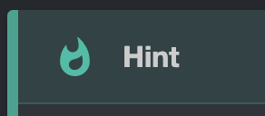

# About this documentation

## How to write the documentation

This documentation is written in Markdown.
Using some plugins we cann add some new features to it.
As soon as a _new feature_ is added, it will be documented here.

### Tags

You can add tags to you docs by adding a `.meta.yml` file or adding the tags directly to the markdown file in a embedded yaml block.
You can find more information about it in the personal [MkDocs Documentation](../web-dev/static-site-generator/mkdocs.md#step-4-create-tags).

### Code Blocks

You can add code blocks by using triple backticks ``` before and after the code block.
You can also specify the language for syntax highlighting:

- **add title**: add `title="your title"` after the language to give the code block a title.
- **line numbers**: add `linenums="1"` after the language to enable line numbers.
- **highlight lines**: add `hl_lines="1 2 3"` after the language to highlight specific lines.
  
!!! tip
    You can highlight inline codeblocks by adding a shebang `!#` followed by the langauge code:

    ```markdown
    `!#python print("Hello, World!")`
    ```

### Admonition Blocks

We have the possibility to add boxes with a colored border and symbol to emphasize or highlight some important information.

!!! example
    ```markdown
    !!! info
        This is an info box.
    ```

add a `""` after the keyword to **hide the title** of the box and only show the content.

There are the following options:

| Text                                  | Output                                                                  |                                                                    Output |                                 Text |
| :------------------------------------ | :---------------------------------------------------------------------- | ------------------------------------------------------------------------: | -----------------------------------: |
| `note`                                |          |      |             `warning` <br> `caution` |
| `summary` <br> `abstract` <br> `tldr` |    |  |                          `attention` |
| `example` <br> `snippet`              |         |            | `fail` <br> `failure` <br> `missing` |
| `info`<br> `todo`                     |          |        |                             `danger` |
| `hint`<br> `tip`                      |          |          |                              `error` |
| `success` <br> `check` <br> `done`    |    |              |                                `bug` |
| `question` <br> `help` <br> `faq`     |  |          |                  `quote` <br> `cite` |

### Detail Blocks
