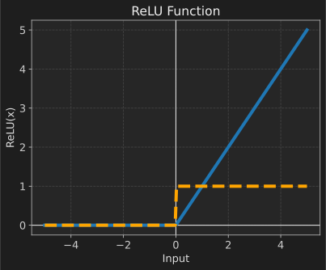
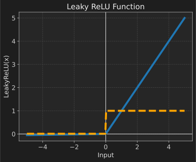
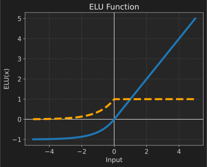
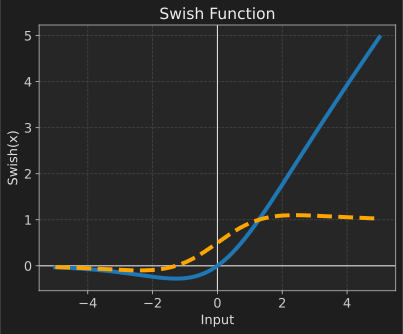
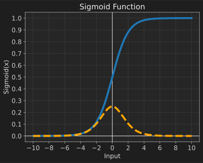
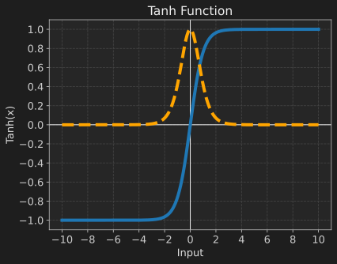

# PyTorch

{.center width="90%"}

> PyTorch is an open-source machine learning library. It is widely used for applications such as computer vision and natural language processing, and is known for its flexibility and ease of use.

```py title="import_pytorch.py"
import torch                    # Main PyTorch library
import torch.nn as nn           # Neural Networks
import torch.optim as optim     # Optimization algorithms
```

## 1. General Information

### 1.1 Comon Practices

- use GPU if available (Windows/Linux -> CUDA, Mac -> MPS)

    ```py
    if torch.backends.mps.is_available() and torch.backends.mps.is_built():
        device = torch.device("mps")
    elif torch.cuda.is_available():
        device = torch.device("cuda")
    else:
        device = torch.device("cpu")
    ```

- fixed random seed for reproducibility
   
    ```py
    if torch.cuda.is_available(): 
        torch.cuda.manual_seed(42)
        torch.cuda.manual_seed_all(42)
    elif torch.backends.mps.is_available() and torch.backends.mps.is_built():
        torch.mps.manual_seed(42)
    else:
        torch.manual_seed(42)
    ```

- set operations to deterministic (may slow down training)

    ```py
    torch.backends.cudnn.deterministic = True
    torch.backends.cudnn.benchmark = False
    torch.use_deterministic_algorithms(True)
    ```

### 1.2 Fundamental Concepts

#### Tensors

Tensors are the fundamental building blocks in PyTorch. They are similar to NumPy arrays but can also be used on GPUs for faster computation.

```py
# Create a 2D tensor (matrix) of shape (3, 4)
tensor = torch.Tensor(3, 4)  # Uninitialized
tensor = torch.zeros(3, 4)   # Filled with zeros
tensor = torch.ones(3, 4)    # Filled with ones
tensor = torch.rand(3, 4)    # Filled with random values between 0 and 1
tensor = torch.randn(3, 4)   # Filled with random values from a _normal distribution_
```

You can manipulate tensors using various operations:

```py
x = x.view(4, 3)  # Reshape tensor to shape (4, 3)
x = x.t()         # Transpose the tensor
x = x +,-,*,/ y  # Element-wise operations
x = x.permute(1, 0)  # Change the order of dimensions
```

#### matmul vs. mm vs. bmm vs. einsum

- `matmul` or `@`: General matrix multiplication that supports broadcasting. It can handle 1D, 2D, and higher-dimensional tensors.
- `mm`: Specifically for 2D tensors (matrices). It does not support broadcasting.
- `bmm`: Batch matrix multiplication for 3D tensors. It multiplies batches of matrices.
- `einsum`: Einstein summation convention, which provides a way to specify complex tensor operations in a concise manner.

> **broadcasting**: Automatically expands the dimensions of tensors to make their shapes compatible for element-wise operations.

!!! tip
    Torch Tensors can be converted to NumPy arrays and vice versa:

    ```py
    # PyTorch tensor to NumPy array
    tensor = torch.ones(3, 4)
    array = tensor.numpy()
    # NumPy array to PyTorch tensor
    array = np.ones((3, 4))
    tensor = torch.from_numpy(array)
    ```

    You can also use standard Python indexing and slicing on tensors like you would with NumPy arrays.

#### Autograd

Autograd is PyTorch's automatic differentiation engine that powers neural network training. It tracks operations on tensors to compute gradients automatically.

```py
# Create a tensor with requires_grad=True to track computations
x = torch.tensor([1.0, 2.0, 3.0], requires_grad=True)
y = x + 2
z = y * y * 3
out = z.mean()

# Compute gradients
out.backward()
print(x.grad)  # Gradient of out with respect to x
```

> The value in `x.grad` mean: if x[i] increases by t then out increases by x.grad[i] * t.
> If you want to stop tracking history on a tensor, you can use `with torch.no_grad():` or `tensor.detach()`.

## 2. Vanilla Neural Networks

To build a neural network in PyTorch, you typically follow these steps:

1. Define a model by subclassing `nn.Module`.
2. Define a loss function and an optimizer.
3. Train the model using a training loop.
4. Evaluate the model on a validation/test set.
5. Save and load the model.

You normaly use `torch.nn` module which provides various layers and loss functions, and `torch.optim` module which provides optimization algorithms.

```py
import torch
import torch.nn as nn
import torch.optim as optim
```

### 2.1 Define a Model

You can define a neural network model by subclassing `nn.Module` and defining the *layers* in the `__init__` method and the *forward pass* in the `forward` method.

```py
class SimpleNN(nn.Module):
    def __init__(self):
        super().__init__()
        self.fc1 = nn.Linear(10, 50)    # First fully connected layer
        self.act_fn = nn.ReLU()         # ReLU activation function
        self.fc2 = nn.Linear(50, 1)     # Second fully connected layer

    def forward(self, x):
        x = self.fc1(x)
        x = self.act_fn(x)
        x = self.fc2(x)
        return x
```

> a Layer is built: `nn.Linear(in_features, out_features)`

Here we used the [ReLU](#relu-activation) activation function between the two fully connected layers.
The output of a neuron is typically passed through an activation function to introduce non-linearity.
More activation functions can be found in the [Activation Functions](#31-activation-functions) section.

We then create an instance of the model and move it to the appropriate device (CPU or GPU).

```py
model = SimpleNN()
model.to(device)  # Move model to the appropriate device
```

### 2.2 Datasets and DataLoaders

PyTorch provides utilities to handle datasets and data loading through `torch.utils.data.Dataset` and `torch.utils.data.DataLoader`.

```py
from torch.utils.data import Dataset, DataLoader
```

#### 2.2.3 Custom Dataset

You can create a custom dataset by subclassing `Dataset` and implementing the `__len__` and `__getitem__` methods.

```py
class CustomDataset(Dataset):
    def __init__(self, data, labels):
        self.data = data
        self.labels = labels
        # or create a data-generation logic here
    
    # Return the size of the dataset
    def __len__(self):
        return len(self.data)
    
    # Return a single sample and its label
    def __getitem__(self, idx):
        sample = self.data[idx]
        label = self.labels[idx]
        return sample, label
```

#### 2.2.4 DataLoader

You can use `DataLoader` to create batches of data and shuffle the dataset.

```py
dataset = CustomDataset(data, labels)
dataloader = DataLoader(dataset, batch_size=32, shuffle=True)
```

!!! info
    The most important parameters of `DataLoader` are:

    - `batch_size`: Number of samples per batch.
    - `shuffle`: Whether to shuffle the data at every epoch. (use it for training set!)
    - `num_workers`: Number of subprocesses to use for data loading. (Use ~ number of CPU cores)
    - `pin_memory`: will copy Tensors into CUDA pinned memory before returning. (use it when using Nvidia GPU)
    - `drop_last`: If `True`, the last incomplete batch will be dropped. (use it for training set!)

### 2.3 Loss Function

We need to define a loss function to measure how well the model is performing.

```py
criterion = nn.BCEWithLogitsLoss()  # Binary Cross Entropy Loss with logits
```

There are mayn different loss functions available.
You can find them in the [Loss Functions](#32-loss-functions) section.

### 2.5 Optimizer

We need to define an optimizer to update the model parameters based on the computed gradients.

```py
optimizer = optim.SGD(model.parameters(), lr=0.01, momentum=0.9)  # Stochastic Gradient Descent
```

Here as well, there are many different optimizers available.
You can find them in the [Optimizers](#33-optimizers) section.

### 2.6 Training Loop

A typical training loop in PyTorch involves iterating over the data, performing forward and backward passes, and updating the model parameters.

```py
def train_model(model, dataloader, criterion, optimizer, num_epochs, device):
    for epoch in range(num_epochs):
        for inputs, labels in dataloader:
            inputs, labels = inputs.to(device), labels.to(device)  # Move data to the appropriate device

            optimizer.zero_grad()               # Clear previous gradients
            outputs = model(inputs)             # Forward pass
            loss = criterion(outputs, labels)   # Compute loss
            loss.backward()                     # Backward pass (compute gradients)
            optimizer.step()                    # Update model parameters

        print(f'Epoch [{epoch+1}/{num_epochs}], Loss: {loss.item():.4f}')
```

### 2.7 Saving and Loading Models

You can save and load model weights using `torch.save()` and `torch.load()`.

```py
# Save model weights
torch.save(model.state_dict(), 'model.pth')

# Create evaluation model and load weights
model = SimpleNN()
model.load_state_dict(torch.load('model.pth'))
model.eval()  # Set the model to evaluation mode
```

> You can theoretically use any file extension, but `.pth` or `.pt` are commonly used for PyTorch models.

### 2.8 Evaluation

To evaluate the model, you typically switch to evaluation mode and disable gradient computation.

```py
def evaluate_model(model, dataloader, device):
    model.eval()  # Set the model to evaluation mode
    correct = 0
    total = 0

    with torch.no_grad():  # Disable gradient computation
        for inputs, labels in dataloader:
            inputs, labels = inputs.to(device), labels.to(device)
            outputs = model(inputs)
            _, predicted = torch.max(outputs.data, 1) # Get the index of the max log-probability
            total += labels.size(0)
            correct += (predicted == labels).sum().item()

    accuracy = 100 * correct / total
    print(f'Accuracy: {accuracy:.2f}%')
```

## 3. Elements of Neural Networks

### 3.1 Activation Functions

The activation functions introduce non-linearity into the neural network, allowing it to learn complex patterns. PyTorch provides several activation functions in the `torch.nn` module.

#### 3.1.1 ReLU (Rectified Linear Unit) {#relu-activation}

The ReLU activation function outputs the input directly if it is positive; otherwise, it outputs zero. It is widely used in hidden layers of neural networks due to its simplicity and effectiveness. <br />
Based on that idea there were also developed a lot of variations, each with their own advantages and disadvantages. <br />
Here are the most common ones:

- **ReLU**: $f(x) = \max(0, x)$

    {.center}

    ```py
    activation = nn.ReLU()
    ```

    >Use this as a default activation function in hidden layers.

    <br />

- **Leaky ReLU**: $f(x) = \max(0.01x, x)$

    {.center}

    ```py
    activation = nn.LeakyReLU(negative_slope=0.01)
    ```

    >Use this when you want to avoid "dying ReLUs" (neurons that always output zero)
    
    <br />

- **ELU (Exponential Linear Unit)**: $f(x) = x$ if $x > 0$ else $\alpha(e^{x} - 1)$

    {.center}

    ```py
    activation = nn.ELU(alpha=1.0)
    ```

    >Use this when you want smooth outputs for negative inputs.

    <br />

- **Swish**: $f(x) = x \cdot \sigma(x)$ where $\sigma(x)$ is the Sigmoid function.

    {.center}

    ```py
    activation = nn.SiLU()  # SiLU is another name for Swish
    ```

    >Use this when you want a smooth, non-monotonic activation function that can improve performance in some cases.

    <br />

!!! warning
    ReLU and its variants can lead to **"dying ReLUs"** where neurons output zero for all inputs.
    This can happen if a large gradient flows through a ReLU neuron, causing the weights to update in such a way that the neuron will always output zero.
    To mitigate this, **consider using Swish** in very deep networks along with the ReLU variants.

#### 3.1.2 Sigmoid

The Sigmoid activation function maps input values to the **range (0, 1)**. It is commonly used in **binary classification** tasks. <br />
However, it is less commonly used in hidden layers due to issues like vanishing gradients.

Formula:
$$
\sigma(x) = \frac{1}{1 + e^{-x}}
$$

{.center}

```py
activation = nn.Sigmoid()
```

#### 3.1.3 Tanh (Hyperbolic Tangent)

The Tanh activation function maps input values to the **range (-1, 1)**. <br />
It is zero-centered, which can help with convergence in some cases.
Use it in hidden layers when negative values are expected.

Formula:
$$
\tanh(x) = \frac{e^{x} - e^{-x}}{e^{x} + e^{-x}}
$$

{.center}

### 3.2 Loss Functions

Loss functions measure **how wrong** a model’s predictions are compared to the true labels.
They tell the optimizer *how much and in which direction to adjust the weights*.

Conceptual Calculation of Loss over a batch:
$$
\text{Loss} = \frac{1}{N} \sum_{i=1}^{N} \text{error}(y_i, \hat{y}_i)
$$

where

- $y_i$ = true value
- $\hat{y}_i$ = predicted value
- `error()` = some function that gets **larger when prediction is worse** (e.g. squared difference, log loss, etc.)
- $N$ = number of samples in the batch

The optimizer then tries to **minimize** this loss.

PyTorch provides various loss functions in the `torch.nn` module.

#### 3.2.1 Binary Cross Entropy Loss

Used for binary classification tasks.
So the model output should be in the range [0, 1] (use Sigmoid activation).

```py
criterion = nn.BCELoss()
# or for logits (more stable)
criterion = nn.BCEWithLogitsLoss()
```

> BCEWithLogitsLoss = Sigmoid + BCELoss
> It is advised to **always prefer BCEWithLogitsLoss** over BCELoss for numerical stability.
> Since it uses the log-sum-exp trick to compute the loss in a more stable way:
> -> $log(e^a + e^b) = max(a, b) + log(1 + e^{-|a-b|})$

#### More Loss Functions are following...

### 3.3 Optimizers

Optimizer have theese main functions:

- `optimizer.zero_grad()`: Clears old gradients from the last batch (otherwise they will accumulate)
- `loss.backward()`: Computes the gradient of the loss w.r.t. the model parameters
- `optimizer.step()`: Updates the model parameters based on the computed gradients

PyTorch provides various optimization algorithms in the `torch.optim` module.

#### 3.3.1 Stochastic Gradient Descent (SGD)

Updates the parameters using the gradient of the loss function.

$$
\theta = \theta - \eta \cdot \nabla_{\theta} J(\theta)
$$

- `θ`: model parameters
- `η`: learning rate
- `J(θ)`: loss function
- `∇θ J(θ)`: gradient of the loss w.r.t. parameters

```py
optimizer = optim.SGD(model.parameters(), lr=0.1, momentum=0.9, weight_decay=1e-4)
```

We can add hyperparameters:

- `lr`: Learning rate (step size for each update). -> Always required.
- `momentum`: Accelerates SGD by adding a fraction of the previous update to the current update.
- `weight_decay`: L2 regularization term to prevent overfitting. It adds a penalty proportional to the square of the magnitude of the parameters.

!!! tip "good starting values"
    - `lr`: 0.001 to 0.1
    - `momentum`: 0.9
    - `weight_decay`: 1e-4 to 1e-3

!!! info "momentum"
    Momentum helps accelerate gradients vectors in the right directions, thus leading to faster converging.
    $$
    v = \beta \cdot m^{(t-1)} + (1 - \beta) \cdot g^{(t)}
    $$
    - `v`: velocity (update vector)
    - `β`: momentum factor (usually close to 1, e.g., 0.9)
    - `m^(t-1)`: previous update
    - `g^(t)`: current gradient

#### 3.3.2 Adam (Adaptive Moment Estimation)

Adam combines the advantages of two other extensions of SGD: AdaGrad and RMSProp. It computes adaptive learning rates for each parameter.

> In simple terms: Adam keeps track of both the average of **past gradients (first moment) and the average of past squared gradients** (second moment) to adaptively adjust the learning rate for each parameter.

**General Tip:** Always prefer *AdamW over Adam* and SGD for better generalization performance.
Since AdamW decouples weight decay from the gradient update, leading to better regularization.

```py
optimizer = optim.Adam(model.parameters(), lr=0.001, betas=(0.9, 0.999), eps=1e-08, weight_decay=0.01)

# or AdamW (decoupled weight decay) -> preferred over Adam
optimizer = optim.AdamW(model.parameters(), lr=0.001, betas=(0.9, 0.999), eps=1e-08, weight_decay=0.01)
```

We have the following hyperparameters:

- `lr`: Learning rate. -> Always required.
- `betas`: Coefficients used for computing running averages of gradient and its square.
    > How much the past gradients influence the current update.
- `eps`: A small constant for numerical stability.
- `weight_decay`: L2 regularization term to prevent overfitting.

!!! tip "good starting values"
    - `lr`: 0.001
    - `betas`: (0.9, 0.999)
    - `eps`: 1e-08
    - `weight_decay`: 1e-4 to 1e-2


### 3.4 Initialization Strategies

Weight initialization is crucial for training deep neural networks effectively. Proper initialization can help mitigate issues like vanishing or exploding gradients.

Strategies you should avoid:

- **Zero /Constant Initialization**: Initializing all weights to zero or a constant value can lead to symmetry breaking issues, where all neurons learn the same features.
- **Large/Small Random Values**: Initializing weights with large or very small random values can lead to exploding or vanishing gradients, respectively.

But these are **good strategies:**

- **Xavier/Glorot Initialization**: Designed for layers with sigmoid or tanh activations. It sets the weights to values drawn from a distribution with zero mean and a specific variance based on the number of input and output neurons.
- **He Initialization**: Specifically designed for layers with ReLU activations. It initializes weights from a distribution with zero mean and a variance of `2/n`, where `n` is the number of input neurons.
- **Kaiming Initialization**: A generalization of He initialization that can be used for various activation functions. It adjusts the variance based on the activation function used in the layer.

Quick reference table:

| Activation                      | Init         | `torch.nn.init` call          |
| ------------------------------- | ------------ | ----------------------------- |
| **Sigmoid / Tanh**              | Xavier       | `nn.init.xavier_uniform_`     |
| **ReLU / Leaky / Swish / GELU** | He / Kaiming | `nn.init.kaiming_uniform_`    |
| **SELU**                        | LeCun        | manual `std = 1/sqrt(fan_in)` |
| **Linear (no act)**             | Xavier       | `nn.init.xavier_uniform_`     |
| **RNN / LSTM**                  | Orthogonal   | `nn.init.orthogonal_`         |

!!! info
    Usually you don't have to manually initialize weights, as PyTorch layers come with sensible default initializations. <br />
    So you just instantiate the model:

    ```py
    model = SimpleNN()
    ```

    and PyTorch will take care of the initialization for you.
    > for Linear layers it uses Kaiming Uniform by defaul since ReLU is the most common activation function and it also works well with others.

You only need to manually initialize weights if you want to use a specific strategy or if you are implementing custom layers.

