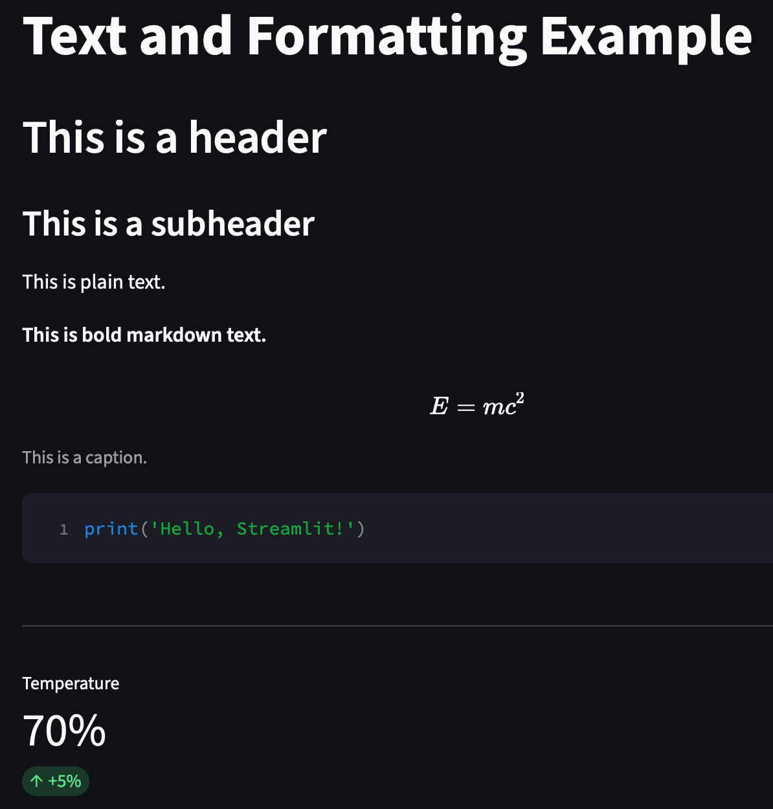
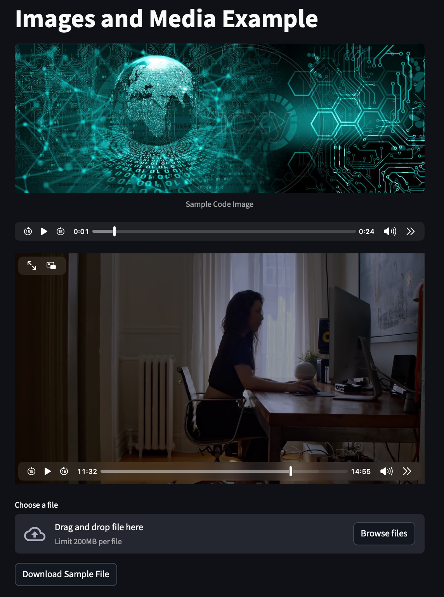
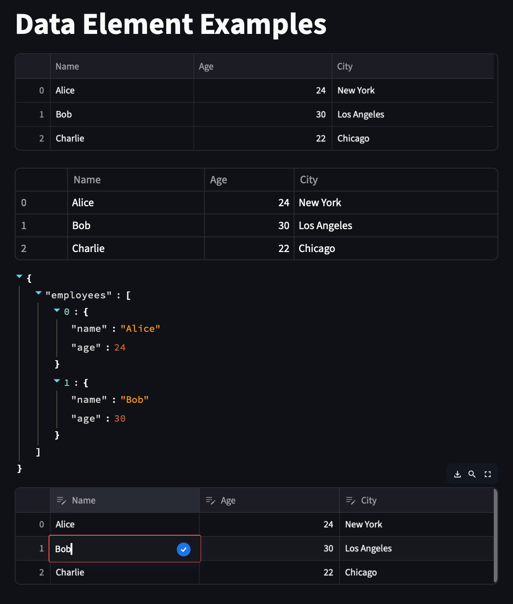
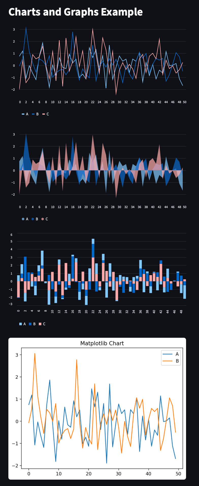
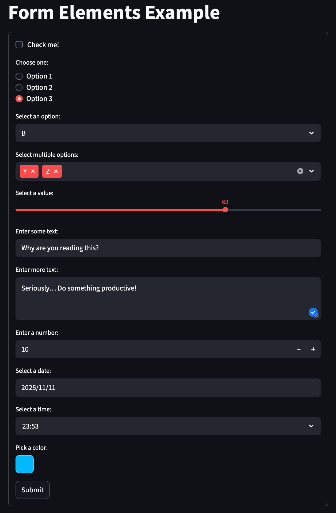
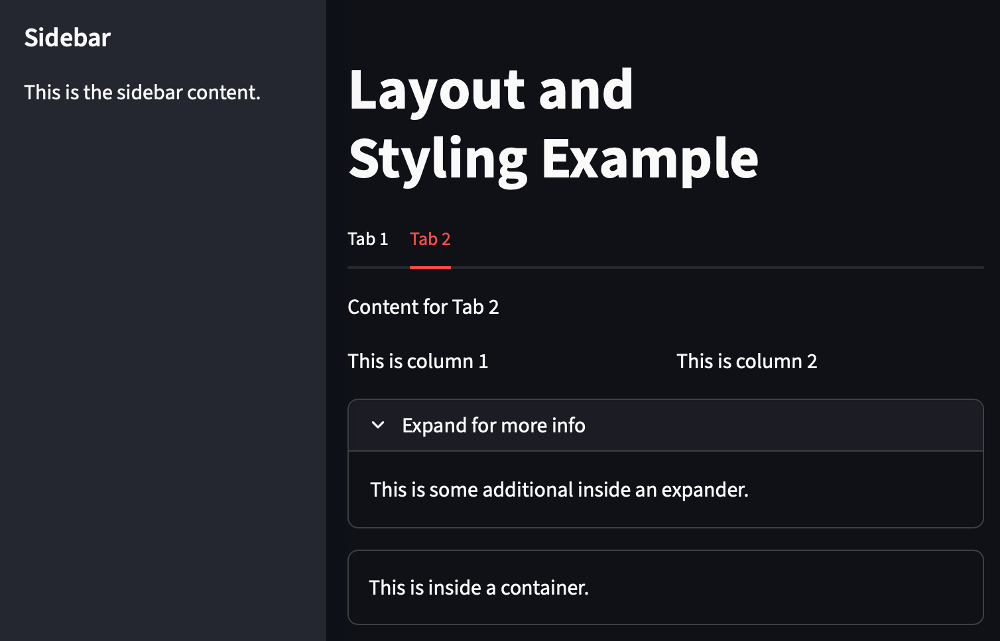

---
tags:
    - python
    - libraries
    - streamlit
    - web apps
    - data science
    - machine learning
---

# Streamlit


[Streamlit](https://streamlit.io/) is an open-source Python library that makes it easy to create and share beautiful, custom **web apps** for *machine learning* and *data science* with pure Python.

## 0 Installation / Setup

First it is recommended to create a virtual environment for your Streamlit projects. You can do this using [uv](../uv-package-manager.md).

After that you can install Streamlit via uv:

```bash
uv add streamlit matplotlib pandas numpy
```

> Note: In addition to Streamlit, it is recommended to also install `matplotlib`, `pandas`, and `numpy` as they are commonly used libraries in data science applications.

## 1 Creating a Simple Streamlit App

Create a new Python file, e.g., `app.py`, and add the following code:

```python
import streamlit as st

st.title('Simple Streamlit App')
st.write("This is a simple Streamlit app demonstrating basic features.")
```

You then can run the app using the command:

```bash
streamlit run app.py
```

This will start a local web server and open the app in your default web browser.

### 1.1 Streamlit Magic

Streamlit automatically interpretes whatever you throw at it. So besides `st.write()`, you can also use inline expressions like:

```python
"hello" if True else "goodbye"
```

And Streamlit will render the output automatically.

### 1.2 Data Flow

**Streamlit apps run from top to bottom every time you interact with them.** This means that any change in input widgets will cause the **entire script to rerun**, updating the output accordingly.

## 2 Streamlit Components

Streamlit provides a variety of built-in components to create interactive web apps. Here are some commonly used components:

### 2.1 Text and Formatting

Streamlit offers several functions for displaying text and formatting:

- `st.title()`, `st.header()`, `st.subheader()`, `st.text()`: normal text
- `st.write()`: displaying text, data, and more (see [streamlit magic](#11-streamlit-magic))
- `st.markdown()`: markdown formatted text
- `st.latex()`: rendering LaTeX equations
- `st.caption()`: adding captions to elements
- `st.code()`: displaying code snippets
-> also pass language & line numbers -> `st.code(code, language='python', line_numbers=True)`
- `st.divider()`: horizontal divider
- `st.metric()`: display key performance indicators (KPIs) with optional delta values

??? example "Example: Text and Formatting"

    { width="50%" align=right}

    ```python
    st.title("Streamlit Text and Formatting Example")
    st.header("This is a header")
    st.subheader("This is a subheader")
    st.text("This is plain text.")

    st.markdown("**This is bold markdown text.**")

    st.latex(r"E = mc^2")

    st.caption("This is a caption.")

    st.code("print('Hello, Streamlit!')", 
            language='python', 
            line_numbers=True)

    st.divider()

    st.metric(label="Temp", value="70%", delta="+5%")
    ```
 
### 2.2 Images and Media

- `st.image()`: displaying images
- `st.audio()`: playing audio files
- `st.video()`: playing video files
- `st.file_uploader()`: uploading files
- `st.download_button()`: downloading files

??? example "Example: Images and Media"

    { width="50%" align=right}

    ```python
    st.title("Images and Media Example")

    st.image("./assets/code-image.jpg", 
            caption="Sample Code Image")

    audio_file = open("./assets/important-audio.mp3", "rb")
    st.audio(audio_file.read(), format="audio/mp3")

    video_file = open("./assets/crazy-video.mp4", "rb")
    st.video(video_file.read())

    uploaded_file = st.file_uploader("Choose a file")
    if uploaded_file is not None:
        st.write("File uploaded:", uploaded_file.name)

    st.download_button(
        label="Download Sample File", 
        data="Sample file content", 
        file_name="sample.txt"
    )
    ```

### 2.3 Data Elements

Streamlit uses `pandas` DataFrames for tabular data representation.

- `st.dataframe()`: interactive table with sorting and filtering
- `st.table()`: static table
- `st.json()`: displaying JSON data
- `st.data_editor()`: editable table for user input

??? example "Example: Data Elements"

    { width="50%" align=right}

    ```python
    import pandas as pd

    st.title("Data Element Examples")

    data = {
        "Name": ["Alice", "Bob", "Charlie"],
        "Age": [24, 30, 22],
        "City": ["New York", "Los Angeles", "Chicago"],
    }
    df = pd.DataFrame(data)

    st.dataframe(df)

    st.table(df)

    json_data = {"employees": [
        {"name": "Alice", "age": 24}, 
        {"name": "Bob", "age": 30}
    ]}
    st.json(json_data)

    edited_df = st.data_editor(df)
    ```

### 2.4 Charts and Graphs

Streamlit supports various charting libraries like Matplotlib, Plotly, etc. and also provides built-in charting functions.

- `st.line_chart()`, `st.area_chart()`, `st.bar_chart()`, `st.map`: quick charting functions
- `st.pyplot()`: displaying Matplotlib figures

??? example "Example: Charts and Graphs"

    { width="50%" align=right}

    ```python
    import pandas as pd
    import numpy as np
    import matplotlib.pyplot as plt

    st.title("Charts and Graphs Example")

    # Sample data
    data = pd.DataFrame(
        np.random.randn(50, 3), 
        columns=['A', 'B', 'C']
    )

    st.line_chart(data)
    st.area_chart(data)
    st.bar_chart(data)

    # Matplotlib figure
    fig, ax = plt.subplots()
    ax.plot(data['A'], label='A')
    ax.plot(data['B'], label='B')
    ax.set_title('Matplotlib Chart')
    ax.legend()

    st.pyplot(fig)
    ```

### 2.5 Form Elements

Streamlit provides various form elements to capture user input:

- `st.checkbox()`: checkbox
- `st.radio()`: radio buttons
- `st.selectbox()`: dropdown select box
- `st.multiselect()`: multi-select box
- `st.slider()`: slider
- `st.text_input()`: single-line text input
- `st.text_area()`: multi-line text input
- `st.number_input()`: numeric input
- `st.date_input()`: date picker
- `st.time_input()`: time picker
- `st.color_picker()`: color picker

!!! warning
    Each Form Element has to conatin a `st.form_submit_button()` to trigger the form submission!

> The App only gets updated when the submit button is pressed.

??? example "Example: Form Elements"

    { width="50%" align=right}

    ```python
    st.title("Form Elements Example")

    with st.form(key='my_form'):
        checkbox = st.checkbox("Check me!")
        radio = st.radio("Choose one:", ["Option 1", "Option 2", "Option 3"])
        selectbox = st.selectbox("Select an option:", ["A", "B", "C"])
        multiselect = st.multiselect("Select multiple options:", ["X", "Y", "Z"])
        slider = st.slider("Select a value:", 0, 100, 50)
        text_input = st.text_input("Enter some text:")
        text_area = st.text_area("Enter more text:")
        number_input = st.number_input("Enter a number:", min_value=0, max_value=100, value=10)
        date_input = st.date_input("Select a date:")
        time_input = st.time_input("Select a time:")
        color_picker = st.color_picker("Pick a color:")

        submit_button = st.form_submit_button(label='Submit')

    if submit_button:
        # Display the input values or process them as needed
    ```

## 3 Data Persistence with Session State & Callbacks

Streamlit provides a `st.session_state` object to store and manage state across user interactions. This is useful for **preserving user inputs**, selections, and other data between app reruns.

It acts like a dictionary where you can store key-value pairs.

### 3.1 Using Session State

You can use `st.session_state` to store values that need to persist across interactions.

You can initialize session state variables, update them based on user actions, and retrieve them as needed.

For example here's how to create a simple counter that increments each time a button is pressed:

```python
if 'counter' not in st.session_state:
    st.session_state.counter = 0

if st.button('Increment Counter'):
    st.session_state.counter += 1

st.write(f"Counter value: {st.session_state.counter}")
```

!!! info
    When a widget is no longer rendered, its value is removed from `st.session_state`. To **retain the value**, you can:

    - set a default value when initializing the session state variable:
    ```python
    if 'my_value' not in st.session_state:
        st.session_state.my_value = default_value
    ```
    - pass a `value` parameter to the widget to set its initial value:
    ```python
    st.text_input("Enter text:", value=st.session_state.my_value)
    ```

### 3.2 Callbacks

Streamlit allows you to define callback functions that get executed when certain events occur, such as when a button is clicked or a form is submitted. Callbacks are useful to **fix issues** with the app rerunning from **top to bottom on every interaction**.

For example, you can define a callback function to update a session state variable when a button is clicked:

```python
def increment_counter():
    st.session_state.counter += 1

if 'counter' not in st.session_state:
    st.session_state.counter = 0

st.button('Increment Counter', on_click=increment_counter)
st.write(f"Counter value: {st.session_state.counter}")
```

Here the `increment_counter` function is called whenever the button is clicked, **before** the app reruns, ensuring that the counter is updated correctly.

## 4 Layout and Styling

Streamlit provides various options for customizing the layout and styling of your app:

- `st.sidebar`: create a sidebar for navigation and controls
- `st.tabs()`: create tabbed sections
- `st.columns()`: create multi-column layouts
- `st.expander()`: create expandable/collapsible sections
- `st.container()`: group elements together
- `st.set_page_config()`: set page title, icon, layout, and initial sidebar
- *Theming:* customize colors, fonts, and styles via a `config.toml` file

??? example "Example: Layout and Styling"

    { width="50%" align=right}

    ```python
    st.set_page_config(
        page_title="Layout and Styling Example",
        layout="wide",
        initial_sidebar_state="expanded"
    )

    st.title("Layout and Styling Example")

    with st.sidebar:
        st.header("Sidebar")
        st.write("This is the sidebar content.")

    tabs = st.tabs(["Tab 1", "Tab 2"])
    with tabs[0]:
        st.write("Content for Tab 1")
    with tabs[1]:
        st.write("Content for Tab 2")
    
    col1, col2 = st.columns(2)
    with col1:
        st.write("This is column 1")
    with col2:
        st.write("This is column 2")
    
    with st.expander("Expand for more info"):
        st.write("This is some information inside an expander.")
    
    with st.container(border=True):
        st.write("This is inside a container.")
    ```

## 5 Caching Data

Streamlit provides a caching mechanism to optimize performance by storing the results of expensive computations.

!!! info
    This cashed data is persistent across app reruns AND accross different users of the app! So be careful what you cache!

### 5.1 Using @st.cache_data

You can use the `@st.cache_data` decorator to cache the output of functions that perform expensive computations or data loading.
This cache is immutable and is intended for data that does not change frequently.

```python
@st.cache_data(ttl=60) # cache for 60 seconds
def load_data(file_path):
    # Simulate an expensive data loading operation
    data = pd.read_csv(file_path)
    return data

data = load_data('large_dataset.csv')
st.write(data)
```

### 5.2 Using @st.cache_resource

If you need to cache mutable resources like database connections or machine learning models, you can use the `@st.cache_resource` decorator.

```python
@st.cache_resource
def get_file_handler():
    # Simulate an expensive resource creation
    handler = open('large_file.txt', 'r')
    return handler

file_handler = get_file_handler()
st.write(file_handler.read())
```

Here, the `get_file_handler` function creates a file handler that is cached and reused across app reruns. So everyone accessing the app will share the same file handler instance.

## 6 Planned Reruns

### 6.1 entire App Rerun

You can use `st.rerun()` to programmatically trigger a rerun of the app.
This can be usefule where you want to keep a output in sync with some source below it in the code like a counter of a button press:

```python
if 'count' not in st.session_state:
    st.session_state.count = 0
    
st.write(f"Count value: {st.session_state.count}")

if st.button('Increment Count'):
    st.session_state.count += 1
    st.rerun()
```

### 6.2 Fragment Rerun

You define elements within a `@st.fragment()` decorator to only rerun that specific fragment of the app when a widget inside it is interacted with.

If you interact with a widget outside the fragment, the entire app reruns as usual.

```python
@st.fragment
def toggle_and_text():
    st.toggle("Toggle me")
    st.text_input("Enter some text:")

toggle_and_text()
st.button("Outside") # Reruns entire app
```

!!! note
    You can't return values from fragments. If you need to share data between fragments and the main app, use [`st.session_state`](#31-using-session-state).

## 7 Multi Page Apps

Streamlit supports multi-page applications, allowing you to create apps with multiple pages or views.

You can create **separate Python files for each page** and use Streamlit's built-in navigation features to switch between them.

You have to create a folder named `pages` in the same directory as your main app file. Each Python file in the `pages` folder represents a separate page in your app.

The naming convention for the page files is important. The file names should start with a number followed by an underscore and the page name, e.g., `1_home.py`, `2_about.py`, etc. (You can also add emojis to the file names for better visual representation in the sidebar.)

Here's an example of how to structure a multi-page Streamlit app:

```bash
my_streamlit_app/
├── main.py
└── pages/
    ├── 1_📈_charts.py
    ├── 2_🌍_mapping.py
    └── 3_📊_dataframe.py
```

!!! tip
    you can **switch pages programmatically** using `st.switch_page("page_name")` where `page_name` is the name of the page file *without the number and underscore*, e.g., `charts`, `mapping`, etc.

    ```python
    if st.button("Go to Charts Page"):
        st.switch_page("charts")
    ```
