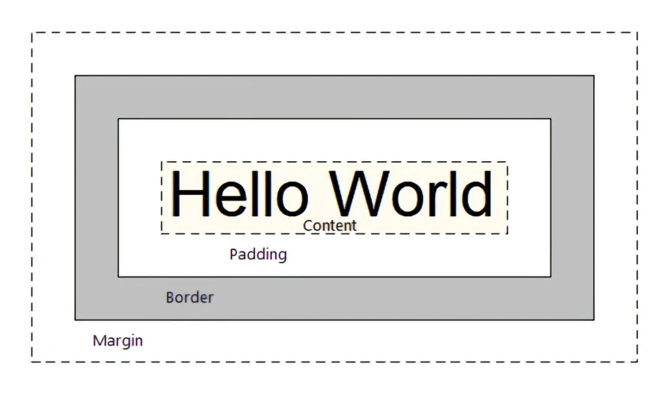

# CSS Box Model

{ .center width=50% }

## Border & Border-Radius

<div class="grid" markdown>

We can style the borders of elements using the `border` property, which allows us to define the width, style, and color of the border. (Usually, we use `px` for the width).

```css
div {
    /* width, style, color */
    border: 2px solid black;
}
```

</div>

!!! warning "box-sizing: border-box"
    By default, the `width` and `height` of an element only include the content area (`content-box`). The padding and border are **added** to the total size of the element. <br>
    To include padding and border in the element's total width and height, we can use the `box-sizing: border-box;` property.

### Border-Radius

To create rounded corners, we can use the `border-radius` property. It can take one or more values to define the radius of each corner. And we can use either `px` or `%` for the radius. <br>
`px` defines a fixed radius, while `%` defines a radius relative to the element's dimensions.

```css
div {
    border-radius: 10px;                /* All corners */
    border-radius: 10px 20px;           /* Top-left & bottom-right, top-right & bottom-left */
    border-radius: 10px 20px 30px 40px; /* Top-left, top-right, bottom-right, bottom-left */
    border-radius: 50%;                 /* Circle (if width = height) */
}
```

## Padding

The `padding` property allows us to add ^^**space between the content and border**^^ of an element. It can take one or more values to define the padding for each side of the element. (`rem`and `em`are the most common units for modern UIs.)

```css
div {
    padding: 10px;                  /* All sides */
    padding: 10px 20px;             /* Top & bottom, left & right */
    padding: 10px 20px 30px;        /* Top, left & right, bottom */
    padding: 10px 20px 30px 40px;   /* Top, right, bottom, left */
}
```

## Margin

The `margin` property allows us to add ^^**space outside the element**^^. It can take one or more values to define the margin for each side of the element. (`rem`and `em`are the most common units for modern UIs.)

```css
div {
    margin: 10px;                  /* All sides */
    margin: 10px 20px;             /* Top & bottom, left & right */
    margin: 10px 20px 30px;        /* Top, left & right, bottom */
    margin: 10px 20px 30px 40px;   /* Top, right, bottom, left */
}
```

!!! info "margin auto"
    The `margin: auto;` property can be used to center an element horizontally within its parent container. It works by automatically adjusting the left and right margins to take up the remaining space.

## Display Property

> The `display` property specifies how an element is displayed and how it interacts with other elements in the document flow. It can take various values, each affecting the layout and behavior of the element differently.

- **block**: The element is displayed as a block-level element, taking up the **full width available** and starting on a **new line**. Examples include `<div>`, `<p>`, and `<h1>`.
- **inline**: The element is displayed as an inline-level element, taking up only **as much width as necessary** and not starting on a new line. Examples include `<span>`, `<a>`, and `<strong>`.
- **inline-block**: The element is displayed as an inline-level element but **behaves like a block-level** element, allowing for setting width and height. Examples include `` and `<button>`.
- **flex**: The element is displayed as a flex container, allowing for flexible layouts and alignment of its child elements. Examples include `<div>` with `display: flex;`. Also see [Flexbox](./04_css-flexbox.md).
- **grid**: The element is displayed as a grid container, allowing for two-dimensional layouts and alignment of its child elements. Examples include `<div>` with `display: grid;`.
- **none**: The element is not displayed at all, and it does not take up any space in the document flow. Examples include `<script>` and `<style>`.

